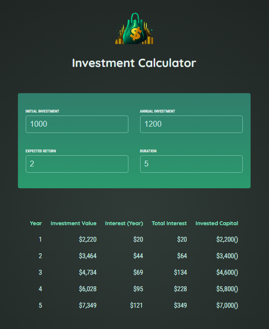

# React Investment Calculator

## Description

This project is a web application that simulates the growth of an investment over time.

## How to Use

1. Clone the project to your computer.
2. Install project dependencies using the command `npm install`.
3. Start the application using the command `npm start`.
4. Enter investment data into the form.
5. The results will be displayed in the table.

## Components

- **Header.jsx:**
  The Header.jsx component represents the header of the application.
  It displays the application title and other navigation elements, such as links to other pages or sections of the application.
- **UserInput.jsx:**
  The UserInput.jsx component represents the data input form of the application.
  It allows the user to input investment information, such as initial value, annual investment, expected annual return, and investment duration.
- **Results.jsx:**
  The Results.jsx component represents the results section of the application.
  It displays a table with the investment results for each year of the provided duration, including the final investment value, earned interest, total accumulated interest, and annual investment.

## Utilities (investment.js)

- **calculateInvestmentResults(input):**
  This function calculates the investment results for each year of the provided duration.
  It takes an input object as a parameter, containing the investment information:
  - initialInvestment: Initial investment
  - annualInvestment: Annual investment
  - expectedReturn: Expected annual return
  - duration: Investment duration (years)
- **formatter:**
  This function formats a numerical value as currency, using the American standard (US dollar).

## Final Considerations

This project is an example of how to use the React library to create a web application. The project can be used as a base to create more complex React applications.

## Useful Links

- <a href="https://react.dev/" target="_blank">React Documentation</a>

## Screenshots

## License

This project is licensed under the MIT License.
